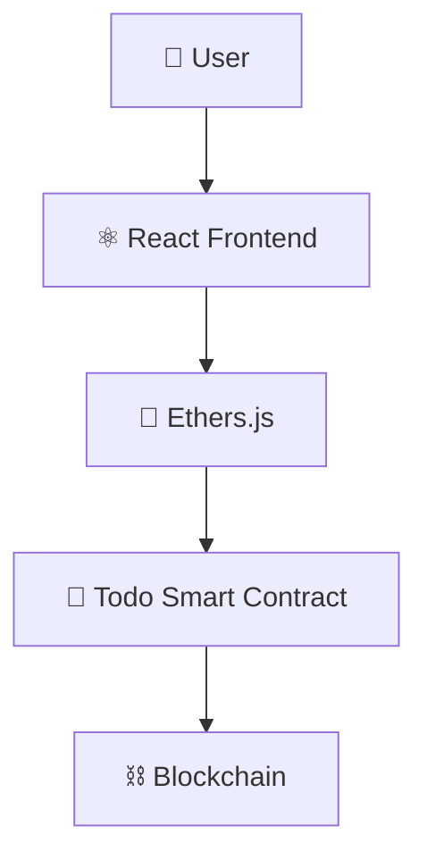

<div align="center">

# ✅ Todo DApp

**A blockchain-powered task management application with transparent, on-chain task storage**


</div>

---

## 📑 Table of Contents

- [Overview](#-overview)
- [Features](#-features)
- [Tech Stack](#-tech-stack)
- [Architecture](#-architecture)
- [Smart Contract Functions](#-smart-contract-functions)
- [Getting Started](#-getting-started)
- [Learning Outcomes](#-learning-outcomes)
- [Future Improvements](#-future-improvements)
- [Author](#-author)

---

## 📖 Overview

**Todo DApp** is a blockchain-powered task management application that enables users to create and manage tasks using a smart contract. Unlike traditional applications, task data is stored **on-chain**, providing transparency and immutability that a centralized backend can't offer.

---

## ✨ Features

| Feature | Description |
|---|---|
| ➕ Add Tasks | Create new tasks stored on-chain |
| ☑️ Complete Tasks | Toggle task completion status |
| 📋 View Task List | Fetch all tasks from the contract |
| 🔗 Smart Contract Storage | Tasks persist immutably on the blockchain |
| 👛 Wallet Connection | Connect via MetaMask or any injected wallet |

---

## 🛠 Tech Stack

| Layer | Technologies |
|---|---|
| **Frontend** | React, JavaScript, Ethers.js |
| **Blockchain** | Solidity, Hardhat, Ethereum |

---

## 🏗 Architecture



---

## 📜 Smart Contract Functions

| Function | Type | Description |
|---|---|---|
| `addTask()` | Write | Adds a new task to the contract's storage |
| `toggleTask()` | Write | Flips a task's completion status |
| `getTasks()` | Read | Returns the full list of tasks |

```solidity
function addTask(string memory _text) public {
    tasks.push(Task(_text, false));
}

function toggleTask(uint256 _index) public {
    tasks[_index].completed = !tasks[_index].completed;
}

function getTasks() public view returns (Task[] memory) {
    return tasks;
}
```

---

## 🚀 Getting Started

### Prerequisites
- Node.js (v16+)
- MetaMask browser extension
- Hardhat

### Installation

```bash
# Clone the repository
git clone https://github.com/Jeevan9898/todo-dapp.git
cd todo-dapp

# Install dependencies
npm install

# Compile the smart contract
npx hardhat compile

# Start a local blockchain
npx hardhat node

# Deploy the contract
npx hardhat run scripts/deploy.js --network localhost

# Start the frontend
cd frontend
npm install
npm start
```

---

## 🎓 Learning Outcomes

- Structs in Solidity
- Arrays in Smart Contracts
- State Management
- React + Blockchain Development

---

## 🔮 Future Improvements

- [ ] Task Categories
- [ ] Due Dates
- [ ] User-specific Tasks
- [ ] IPFS Storage

---

## 👤 Author

**Jeevan Yadav**

[](https://jeevan-yadav.vercel.app/)
[](https://github.com/Jeevan9898)
